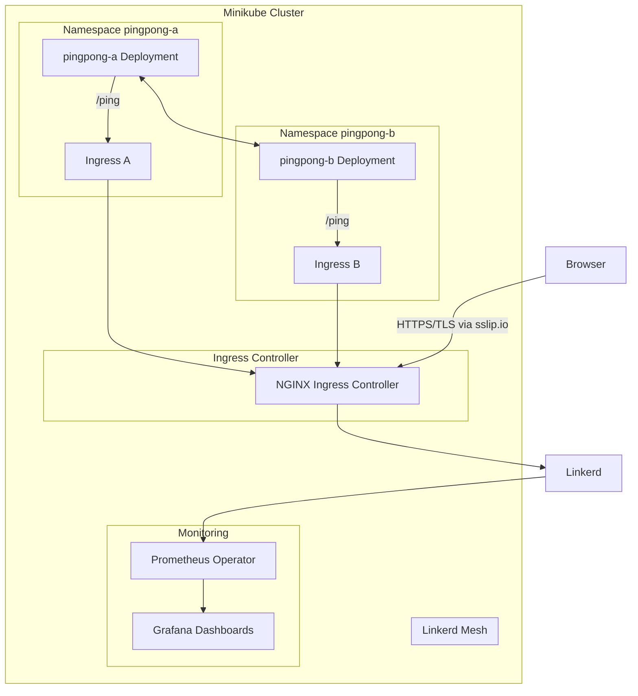

# ESGBook Platform Engineer Exercise – Completed Solution

This repository contains the exercise for the ESGBook Platform Engineer role, **with enhancements implemented** to make the cluster more production-ready.  

---

## Time

You can either do this test before the interview or during, we usually recommend doing it before, so we can discuss your
findings during the interview.  

---

## Requirements

- [Minikube](https://minikube.sigs.k8s.io/docs/start/) (used in Makefile, but other local clusters work)
- [Docker](https://www.docker.com/)
- [Go](https://golang.org/) (for building the PingPong service)
- [Helm](https://helm.sh/)  
- [mkcert](https://github.com/FiloSottile/mkcert)  
- [kubectl](https://kubernetes.io/docs/tasks/tools/)  
- GNU Make  

---

## Introduction

The PingPong service has two core functionalities:

- **Pinging** – periodically sends a request to another service every `n` ticks  
- **Ponging** – responds with a `pong` message when called at `GET /ping`  

On top of this, we **implemented several optional production-readiness features**:  

✅ Dockerfile for building service container  
✅ HTTPS via ingress-nginx + cert-manager + mkcert  
✅ Prometheus metrics instrumentation in service + scraping config  
✅ Linkerd service mesh with **mTLS enabled**  
✅ Basic **Network Policies** for zero-trust posture  
✅ Automated Makefile commands (`platform-up`, `platform-up-trusted`, `deploy`)  
✅ Monitoring dashboards for MinIO, CloudNativePG, and Kubernetes components  

---

## How to Run – Step by Step

### 1. Start the cluster
```bash
make platform-up
```
This provisions the Minikube cluster with required addons.  

---

### 2. Enable Minikube tunnel
```bash
minikube tunnel -p esgbook-test-cluster-1
```
> Keep this running in a separate terminal window.  

---

### 3. Deploy trusted platform setup (with TLS)
```bash
make platform-up-trusted
```

---

### 4. Find your Minikube IP
```bash
minikube ip -p esgbook-test-cluster-1
```
Example: `192.168.49.2`

---

### 5. Add manual hosts entries
Because ingress-nginx exposes services as `127.0.0.1` when tunneling, map the sslip.io domains to localhost:  

```bash
echo "127.0.0.1 pingpong-a.192.168.49.2.sslip.io" | sudo tee -a /etc/hosts
echo "127.0.0.1 pingpong-b.192.168.49.2.sslip.io" | sudo tee -a /etc/hosts
```

---

### 6. Verify services
```bash
kubectl get pods -A
```

Access in browser:

- `https://pingpong-a.127.0.0.1.sslip.io/ping`
- `https://pingpong-b.127.0.0.1.sslip.io/ping`  

---

### 7. Service Mesh with mTLS (enabled by `platform-up-trusted`)
`platform-up-trusted` installs and configures Linkerd with mTLS. After running it, simply verify the control-plane is healthy:

```bash
kubectl -n linkerd get pods
linkerd check
```

> If you brought the cluster up without `platform-up-trusted`, you can enable the mesh later with:
> ```bash
> make mesh-up
> kubectl -n linkerd get pods
> linkerd check
> ```

---

### 8. Monitoring Dashboards
- Grafana dashboards for Kubernetes, MinIO, and CloudNativePG are automatically deployed.  
- Access Grafana via Ingress: [https://grafana.127.0.0.1.sslip.io/login](https://grafana.127.0.0.1.sslip.io/login)  
- Ingress manifest: `infra/grafana-ingress-127.yaml`  
- Prometheus Operator scrapes metrics from PingPong and cluster components.  

---

## ✅ Enhancements Implemented

- **HTTPS with mkcert + cert-manager**  
- **Linkerd mTLS** with automatic sidecar injection  
- **Prometheus metrics** instrumentation and scraping  
- **Grafana dashboards** for observability (Kubernetes, MinIO, CloudNativePG)  
- **Network Policies** for zero trust posture  
- **Makefile automation** for cluster lifecycle  

---

## Architecture



---

## Production-Ready Considerations

- CI/CD pipeline for automated builds & deployments  
- Centralized logging (ELK or Loki)  
- Resource requests/limits set for pods  
- HPA (Horizontal Pod Autoscaler)  
- PodSecurityPolicies / OPA Gatekeeper (policy enforcement)  
- Multi-tenancy via namespaces  

---

## Cleanup
```bash
make platform-down
```

---

✨ This solution goes beyond the base task by adding **TLS, mTLS, observability, automation, monitoring dashboards, and security posture improvements**.  
